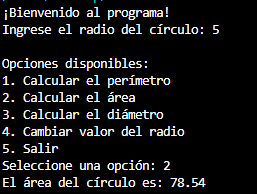

# Cálculos de círculo ⚫
Este programa en Python permite calcular y mostrar las propiedades de un círculo, solicitando al usuario el radio y ofreciendo la opción de calcular el perímetro, el área o el diámetro. Incluye validaciones para asegurar las entradas correctas y presenta una interfaz de usuario sencilla y fácil de usar

## Características 🌟
- Verifica que el radio ingresado sea un número mayor que cero ✅
- Realiza cálculos de perímetro, área y diámetro utilizando la constante π con una precisión de 4 decimales (3.1416) 🔢
- Presenta un menú claro y fácil de usar con opciones enumeradas 1️⃣

## Funcionalidades 🚀
- Solicita el radio del círculo 📏
- Muestra un menú de opciones 🗒️
- Calcula el perímetro 📐
- Calcula el área 📊
- Calcula el diámetro 🔵
- Permite cambiar el valor del radio 🔄
- Opción para salir del programa ❌

## Requisitos 📋
- Python 3.x 🐍
- Entorno de desarrollo compatible (IDLE, PyCharm, etc.) 💻
- No se requieren librerías externas 🚫📦

## Cómo Ejecutar el Programa 💡
- **Instala Python:** 📥 Asegúrate de que Python esté instalado en tu sistema. Puedes descargarlo desde [python.org](https://www.python.org/) 
- **Descarga el Repositorio:** 📂 Clona o descarga este repositorio en tu computadora 
- **Ejecuta el Programa:** 🖥️ Abre tu terminal o entorno de desarrollo y ejecuta el archivo `circulo.py` 
- **Sigue las Instrucciones:** 📋 Una vez que el programa esté en marcha, sigue las indicaciones en pantalla para ingresar los datos 

## Documentación 📚
- **[Análisis del problema](docs/Análisis%20Circulo.pdf)**: 📝 Este documento detalla el análisis de un programa que calcula las propiedades de un círculo, permitiendo al usuario ingresar el radio y elegir entre diferentes operaciones, como el cálculo del perímetro, área y diámetro, asegurando la correcta entrada de datos mediante validaciones 📊
- **[Procesos del problema](docs/Algoritmo%20Circulo.pdf)**: 🔧 Este documento detalla los procesos del programa, definiendo las variables de entrada y salida, así como los procedimientos necesarios para su correcto funcionamiento 🔄
- **[Pseudocódigo](docs/calculoCirculo.psc)**: 📜 Este pseudocódigo en Pseint se guía por el documento de procesos y permite calcular el perímetro, área y diámetro de un círculo, además de gestionar la entrada del usuario a través del menú de opciones 🖥️
- **[Diagrama de flujo](docs/Diagrama%20de%20Flujo%20Circulo.pdf)**: 🌐 Este documento detalla visualmente el flujo del programa y muestra cómo se gestionan las entradas del usuario, así como los cálculos realizados para el círculo de manera clara y concisa ✏️
- **[Código Python](circulo.py)**: 🐍 Este código en Python se guía por el pseudocódigo y permite calcular el perímetro, área y diámetro de un círculo, además de gestionar la entrada del usuario y validar que el radio sea positivo ✔️

## Uso 📊
- Ingresa el radio del círculo cuando se te solicite 📏
- Selecciona la opción del menú deseada 🗒️
- Observa los resultados de los cálculos 👀

**Ejemplo de uso:**
- Radio: 5
- Opción: 2. Calcular área
- Resultado:

